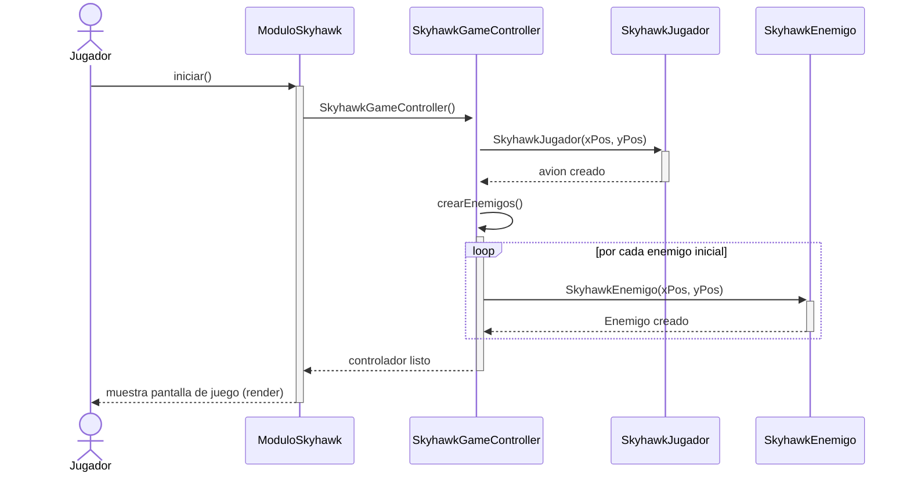
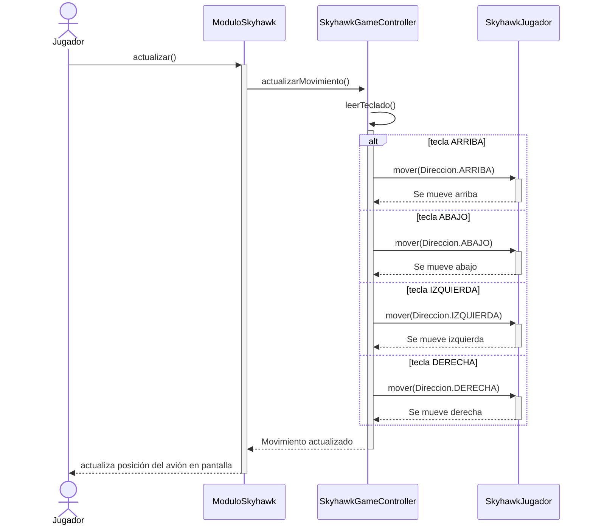
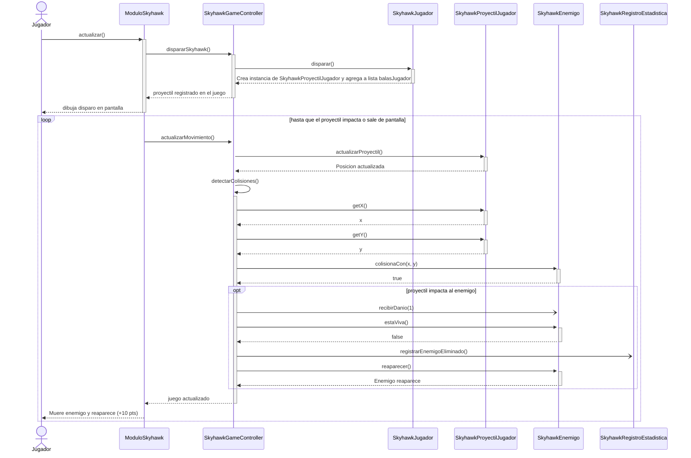
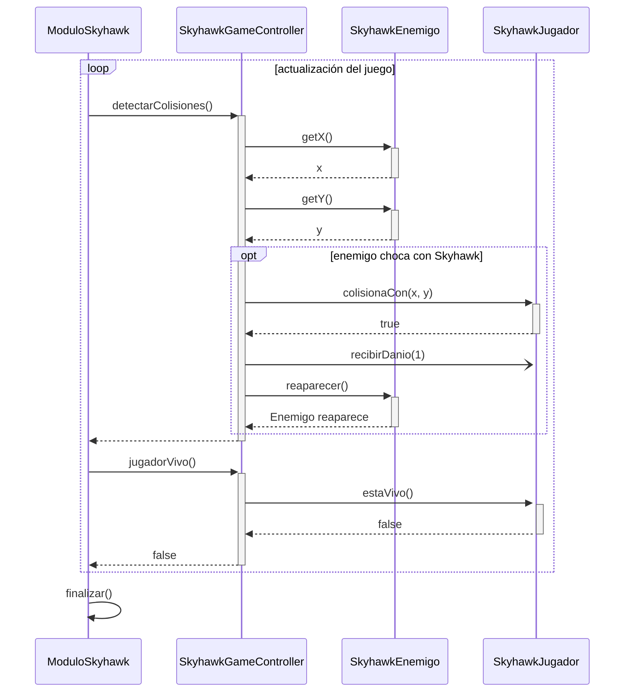
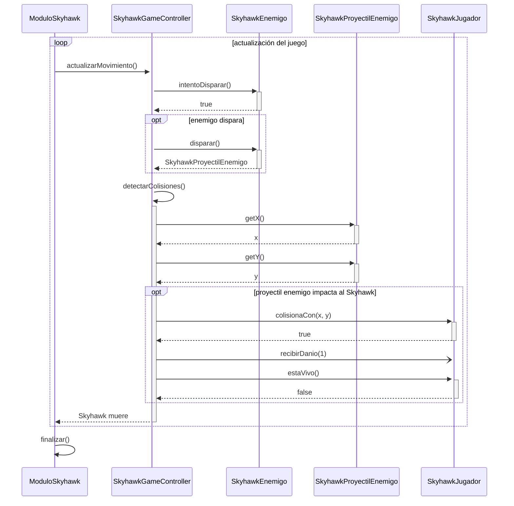
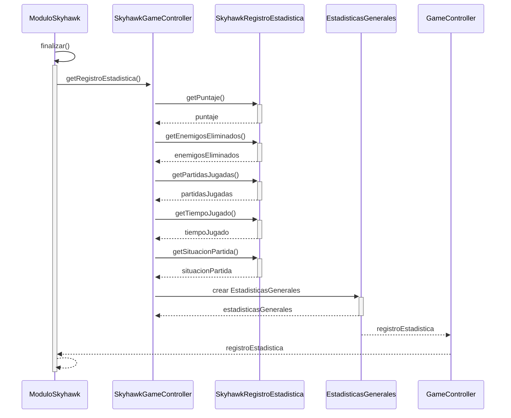
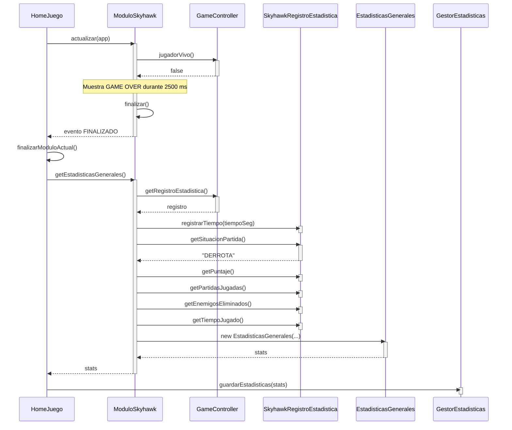

# Diagrama de clases — Módulo Skyhawk

Basado en el diagrama de clases 

## 1. Cargar la partida, el avión e iniciar el juego

## 2. Mover el avión (arriba, abajo, izquierda, derecha)

## 3. Disparar y matar un enemigo

## 4. Morir por colisión 

## 5. Morir por proyectil enemigo

## 6. Estadisticas

## 6. Estadisticas Nuevo

