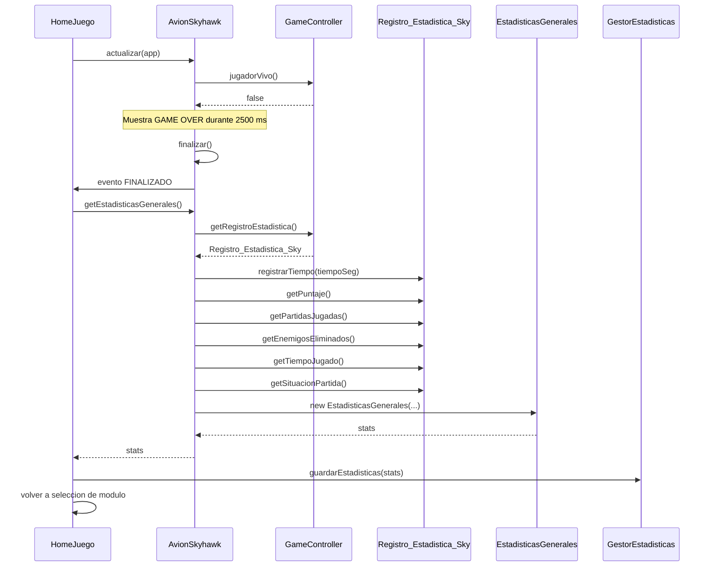

# Diagrama de secuencia simple - fin de partida y estadisticas

Resumen:

- `GameController` detecta que el jugador ya no esta vivo.
- `AvionSkyhawk` espera un momento, finaliza el modulo y avisa al lobby.
- `HomeJuego` recibe el evento `FINALIZADO` y le pide las estadisticas al modulo.
- `AvionSkyhawk` lee el `Registro_Estadistica_Sky` y crea el `EstadisticasGenerales`.
- `HomeJuego` manda ese `EstadisticasGenerales` a `GestorEstadisticas` para guardarlo.

Nota: en el codigo, `GameController` no crea `EstadisticasGenerales`; solo guarda y entrega el `Registro_Estadistica_Sky`. La conversion al formato del lobby la hace `AvionSkyhawk`.
